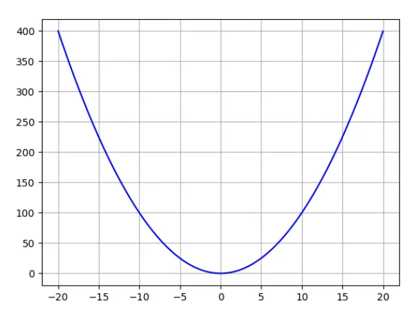
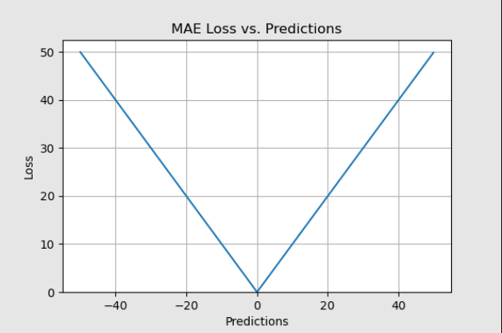
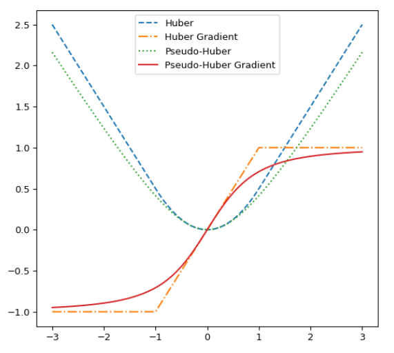
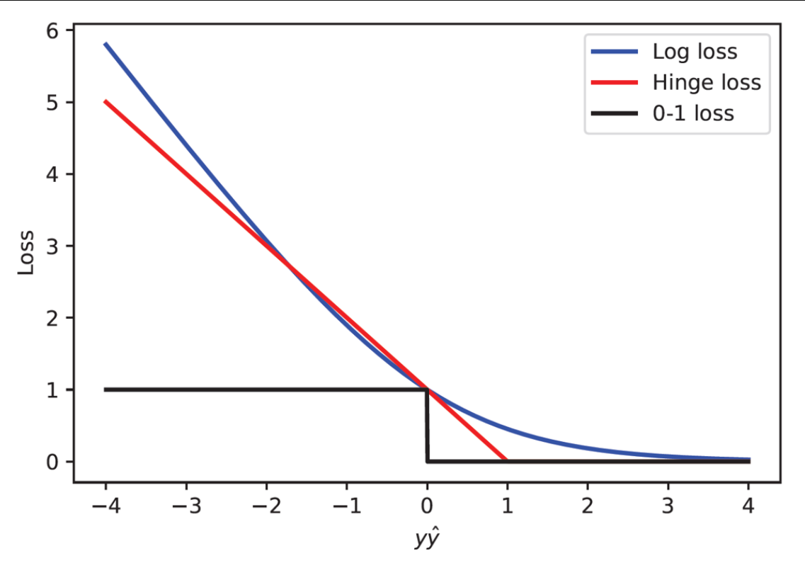

<h1 align="center">Loss Functions</h1>

- Loss Function Used to measure the difference between predicted value and actual value.
- For getting better model we have to reduce the loss.

---

<h2 align="center">Regression Problem Losses</h2>  

- There are 4 types of Regression losses.

1. **Mean Squared Error**.
    $$MSE = \frac{\sum_{i = 1}^{n} (y_{i} - \hat{y_{i}})^{2}}{n}$$
    - Where, 
        - $y_{i}$ = actual value.
        - $\hat{y_{i}}$ = predicted value.
        - n is the total number of records.
    - Why do we square the difference ?..
        - Because to avoid the wrong zero loss model there by avoid the sign of difference.
        - In a plot our points which are above the line has positive slope and points which are below the line has negative slope.
        - So, if we not do the square and if we have equal loss on the both the side then there will be zero loss model which is wrong.
        - So we will square the difference to avoid the wrong zero loss model.
    
    - Problem with MSE:
        - It is succeptible to outlier i.e the best line deviates easily for effect of outliers.

---

2. **Mean Absoulte Error**.
    $$MAE = \frac{\sum_{i = 1}^{n} |y_{i} - \hat{y_{i}}|}{n}$$
    - Here, we take magnitude of difference to ignore the sign of difference.
    
    - Problem with AME:
        - It is not differentiable at a point i.e at 0.

---

3. **Huber Loss**.
    - Used to make sure that model is not prun to outliers.
    - As MSE is more prun to outlier we will use MSE only till certian thershold after the we will use MAE.
    1. Quadratic Loss [MSE like]:
    $$\left(\frac{(y_{i} - \hat{y_{i}})^{2}}{2}\right), if |y_{i} - \hat{y_{i}}| <= \delta$$
    2. Linear Loss [MAE like]:
    $$\left(\delta \times |y_{i} - \hat{y_{i}}| - \frac{\delta^{2}}{2}\right), if |y_{i} - \hat{y_{i}}| > \delta$$
    - $\delta$ is a threshold value above which we use MAE.
    - Problem with Huber loss:
        - It is not differentiable at point of contact of Quardratic and Linear loss.

---

---

4. **Pseudo Huber Loss**.
    $$Pseudo Huber lose = \delta_{2} \times \left(\sqrt{1 + \left(\frac{y_{i} - \hat{y_{i}}}{\delta}\right)^{2}} - 1\right)$$
    - It's is a extension of huber loss.
    - Makes Huber loss differenciable.

---

<h2 align="center">Classification Problem Losses</h2>  

- There are 4 types of classification loss.

1. **Binary Cross Entropy**:
    - Used in binary classification problem.
    - Also called as log-loss.
    $$loss = \sum_{i = 1}^{n} \left(-[y_{i} \times log(\hat{y_{i}})] - [(1 - y_{i}) \times log(1 - \hat{y_{i}})] \right)$$
    - Used in logistic regression.

---

2. **Categorical Cross Entorpy**:
    - Used in multiclass classification problem.
    - Here, We convert output feature value into one hot encoded vector.
    $$loss = - \sum_{i = 1}^{n} \sum_{j = 0}^{p} (y_{ij} \times log(y_{ij})) $$
    - i is for summation for record and j is for summation of one hot encoded vector.
    - Problem with categorical cross entropy:
        - Unneccesary multiplication and addition is the overhead. 
        - As actual value is a one hot encoded vector only one class will have value 1 rest will have 0.
        - As predicted value gives the probability of each class in output feature.
        - Here, we will multiplying all the probability with the log of predicted probability which includes unnecessary multiplication with 0. It is enough to multiple the output class which has 1 with it's log of predict probability.

---

3. **Sparse Categorical Cross Entropy**:
    - Same as categorical cross entropy but there will be no unnecessary multiplication.
    $$loss = -log(\hat{y_{i}})$$
    - where, $\hat{y_{i}}$ is the predicted probability of the output class whose actual value is 1.
    - Here, directly negative log of predicted value of that particular output class will be calculated.

---

4. **Hinge Loss**:
    
    - Hinge loss is designed to penalize predictions that are on the wrong side of the decision boundary.
    $$loss = max[0, (1 - y_{i} \times \hat{y_{i}})]$$
    - Used in Support machine vectors.

---
