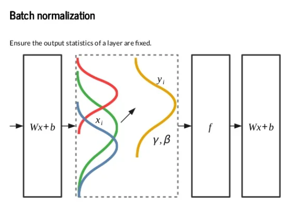

<h1 align="center">Batch Normalization</h1>

- Training data is divided into parts for training neural network those parts of data is called as **Batch**.

- 1 Epoch denotes training of neural network with entire training data only once.

- 1 Epoch will complete only when neural network is trained with **all the batches** when batch size is given during training of the model called as mini batch gradient.

---

- Advantage of Batch training.
    - As we know that during each iteration output will be calculated and after that loss will be calculated. Using loss the weights and bias of the neural network are updated. 
    - So, when there is no batches the entire training is sent to neural network at once. Hence, weigths and bais will be updated only once. Initally weights and bais are initalized at random our network will be trained with the random weigths and bais.
    - But, when we give the batch size then our the updation of weights and bais will done batch size times. Here, 1st batch will be trained with random weights and bais but upcoming batches will be trained with the updated weights and bais of the previous batch which is better than training of network using random weights and bais.

---



---

- A neural network is a parameteric model it is needed to scale the data to avoid the effect of magnitude of data over the feature importance.

- So, After scaling and training the neural network with the scaled data there is no gaurantee that our data remains scaled in between the hidden layers.

- But, if we scale the data at each level then it will be like we are putting more constraint on the output because of which there is a high chance of miss the important information.

- So we will give flexibility to the neural network to scale the data as and how much it's required using $\gamma$ and $\beta$ parameters.

$$N_{i} = \gamma \times S_{i} + \beta$$
- Where, 
    - $\gamma$ is Mutliplier used to provide the flexibility in varying height and width of the distribution.
    - $\beta$ is Scaler used to provide the flexibility in shifting the shifting the distribution.
    - $S_{i}$ is the scaled data.

- $\gamma$ and $\beta$ parameters to be learnt by the neural network itself.

---

- Implementation
    - ```tf.keras.layers.BatchNormalization()``` = adding batch normalization layer in between the hidden layers.
    - ```history = model.fit(x_train, y_train, epoch = 5, batch_size = 32, validation_data = (x_valid, y_valid))``` = giving batch size during the training of model.

---