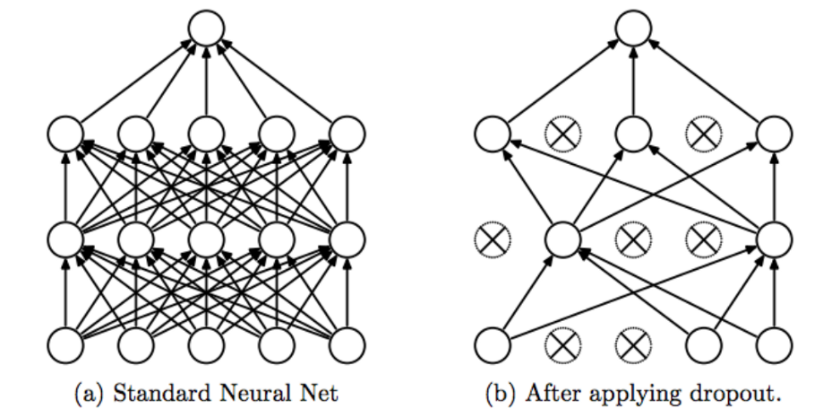
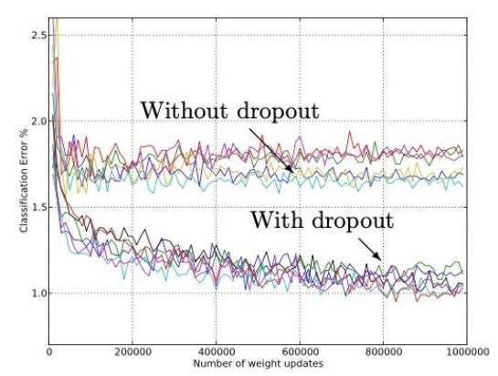

<h1 align="center">Regularisation</h1>

- Used to reduce the overfitting(low bais and high variance).

- Noise or outliers present in the data will make our model less robust(high variance model i.e model prediction changes rapidly for slight changes in the data).

- If our line for 2 input features is $y = \beta_{0} + \beta_{1} \times x_{1} + \beta_{2} \times x_{2}$.

- Change in prediction depend on the $\beta$ values.

- If the value of $\beta$ increases then our curve will take the shape.

- If value of $\beta$ increases then Mean Squared Error decrease which denotes that our model is trying to fit all the data point hence model is high variance model.

---

- Regularization can be done in 3 ways.
    1. Modification of the loss function.
    2. Dropout.
    3. Activation Function - using of relu activation function.

---

1. **Modification of loss function**.
    $$MSE = \frac{\sum_{i =1}^{n} (y_{i} - \hat{y_{i}})^{2}}{n}$$
    1. Lasso Regularization(L1 Regularization).
        - Used for reduction of overfitting.
        $$Loss = MSE + \lambda \times \sum_{i = 1}^{n} |w_{i}|$$
        - Where, $\lambda$ is a hyperparameter called lagrangian parameter used to create the balance between the $\beta$ and MSE.
        - ```model.add(tf.keras.layers.Dense(units = 32, activation = 'relu', kernel_regularizer = tf.keras.regularizers.L1(1e-5), name ='hidden_layer_2'))```
    2. Ridge Regularization(L2 Regularization).
        - Used for feature selection.
        $$Loss = MSE + \lambda \times \sum_{i = 1}^{n} (w_{i})^{2}$$
        - Where, $\lambda$ is a lagrange's parameter same use as in lasso.
        - ```model.add(tf.keras.layers.Dense(units = 32, activation = 'relu', kernel_regularizer = tf.keras.regularizers.L2(1e-4), name ='hidden_layer_2'))```
    3. Elastic Net Regularization.
        - Combination of ridge and lasso regularization.
        $$Loss = MSE + \lambda_{1} \times \sum_{i = 1}^{n} |w_{i}| + \lambda_{2} \times \sum_{i = 1}^{n} (w_{i})^{2}$$
        - ```model.add(tf.keras.layers.Dense(units = 32, activation = 'relu', kernel_regularizer = tf.keras.regularizers.L1L2(l1=1e-5, l2=1e-4), name ='hidden_layer_2'))```
    - This regularization is used to create the balance between the $\beta$ and MSE.

2. **Dropout**.
    - Here, We actually play with the architecture of the neural network.
    - **Intension** is to make all neuron to learn the data.
    
    - While Training our model there is a possibility that our model may have the active learning neurons because of which entire data flow through it i.e those neuron get trained very well meanwhile other neuron which are inactive are not learning anything from the data.
    - To avoid the above problem we are randomly deactivating certian neuron only for that particular iteration so that other neuron may learn something from the data.
    - In this process a baised coin tossing will happen for all the neuron for keeping them or dropping them.
    - Implementation 
        - ```model = tf.keras.models.Sequential()```
        - ```model.add(tf.keras.layers.Dropout(0.2))```
    

---
