<h1 align="center"  style="color: purple;">Object Detection</h1>

- Object Detection we will given an image which contains multiple object to interest then we have to detect the object in the image then we also locate that object with a bounding box.Therefore, it is called as **object detection and localization**. 
- Object Detection will help also in the image classification.By detecting object and cropping object then send for classification which help in classification.
- Training data is prepared using the *annotation tools* like **Roboflow**

---

<h2 align="center" style="color: orange;">RCNN</h2>  

- RCNN = Recurrent Convolution Neural Network
- This is a naive approch to detect the object which is good for understanding object detection intially but we won't implement these as there is complexity in computation.
- Here, the input image is cropped (cropping is done in sliding window approch) and then sent to image classification.
- Problem:
    - We don't know where our image is present.
    - Selecting of sliding window size.
- In RCNN we have 2 aspects:
    1. Generationg of region proposals(images crop).
        - Sliding window.
        - **Selective search** - groping of pixels having same texture to generate segments.
    2. Which algorithm to apply for classification.
- In RCNN we follow the following steps,
    1. We take **a image** from the dataset.
    2. We crop that single image into **2000 crops** of different size.
    3. We **resize** the crops in order to convert all crops into same shape.
    4. The resized crops are passed into a **pretrained CNN**(can use Alexnet which is trained on our data) which can do classification.
    5. Pretrained CNN will generate **feature vector (4096)** for each crop i.e we get 2000 feature vector.
    6. Those feature vectors are passed into different **SVM**(which is trianed on our data) for detection of which object of interest is present in crop.
    7. Then we **backtrack** to our image to **label the crop**.
    8. We continue all 7 steps for remaining images.
- **Non-Max Supression** = If we have multiple crops detecting same object then we *retain the highest confidence* crop and eliminate the overlapping crops(partically detected objects) which are present under that highest confidence crop.
- **Intersection Over Union** = Used to define overlapping of 2 different crops.

<p align="center">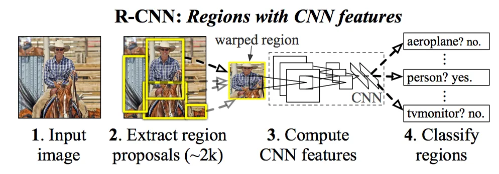</p>

---

<h2 align="center" style="color: orange;">Fast RCNN</h2>

- We noticed that RCNN is a complex architecture but takes 47 sec for a image to detect object.
- So, we use Fast RCNN to detect the object and also find the cooridinates of the object.
- **Sub Sampling Ratio** : The region proposal present in the original image is placed in correct position on feature map using sub sampling ratio.
- **Steps** :
    - Step 1 : 
        1. We will have a **big size image** as input like (640 x 960).
        2. We tell *Selective Search* algorithm to **detect the region proposal** on the original image.
            - We create region proposal with the hypothesis that individual region proposal would atmost contain 1 object. 
    - Step 2 :
        1. Then we will apply **VGG net** on the original image to get the feature map of small size(40 x 60 x 512).
        2. To **place the region proposal in correct possition** on the feature map we use **sub sampling ratio** of vgg net which is 16.
            - sub sampling ratio = $\frac{224}{14}$ = 16 because input layer shape of vgg net is (224 x 224) then output shape is (14 x 14).
        - Now we *cannot apply classification algorithm* because all region proposal **shape are different** so we cannot flatten it.
    - Step 3 : 
        1. We use **ROC pooling** to convert all region proposal to **uniform shape**.
            - We divide the region proposal into (7 x 7) grid.
            - Then we apply the max pooling on each grid.
            - At the end, all our region proposal will be converted to same shape.
        - Now we *can apply the classification algorithm* to detect the object of interest.
    - Step 4 :
        1. We will take all the region proposal of shape (7 x 7 x 512) and **Flatten** it.
        2. We will apply **Fully Connected Dense Layer** of (4096) neuron.
        3. We will apply **Fully Connected Dense Layer** of (4096) neuron.
            - Now, split the into 2 path one layer will be the output of classification problem another will be the bounding box regressor.   
        4. We will apply **Dense layer** with (number of output class) neuron as it acts as output layer.
        5. In parallel to 4 we will apply **Bouding Box Regressor**.
            - Bounding Box Regressor will help to find the *height and width* of region of proposal and also *coordinate of center* of the region proposal . 
- Figure present in Faster RCNN.

---

<h2 align="center" style="color: orange;">Faster RCNN</h2>

- Faster RCNN is faster than Fast RCNN with Region Proposal Network to it.
- RCNN and Fast RCNN can detect only one image bascially those were doing only image classification problem.
- Region Proposal Network is a CNN based approch to generate a region proposal instead selective search as it is fast and also able to detect the multiple objects within a single crop.
- Region Proposal gives a proposal to check wheather object is present in crop or not.
- All object fall under 2 axis i.e aspects and size.
- We apply Regional Neural Network on the Fast RCNN.
- Steps in Regional Neural Network:
    - Step 1: 
        1. Input image of (640 x 960) size is passed through a CNN may by **VGG Net**.
        - Then we will get a feature map of **(40 x 60 x 512) size**.
        - As our Sub Sampling Ratio is 16.
        - Each pixel(neuron) with 512 depth in the feature map contains all the information related to (16 x 16) crop of original image.
    - Step 2:
        1. A Convolution layer of **(1 x 1) with 36 filters** will be appiled on image and we will get a feature map of **(40 x 60 x 36) size**.
        - In this feature map we will group 4 filters(h, w , x and y) and will have 9 groups because each group will represent the height, width and coordinates of center of region proposal.
        - Each group in the feature map represent the anchor box in the image so we have 9 x 4 = 36 filtes.
        - Atmost we can have **9 objects** within a single crop.
    - Step 3:
        1. In **parallel to step 2** we will apply the Convolution layer of **(1 x 1) with 18 filters** and we will get a feature map of **(40 x 60 x 18) size**.
        - In this feature map we will group 2 filters and will have 9 groups because each group will represent the forground and backgroud image.
    - Step 4:
        - Pass the feature proposal identified on the image that represent the type of anchor box to a Fast RCNN.

<h4 align="center" style="color: blue;">Region Proposal Network</h4>
<p align="center">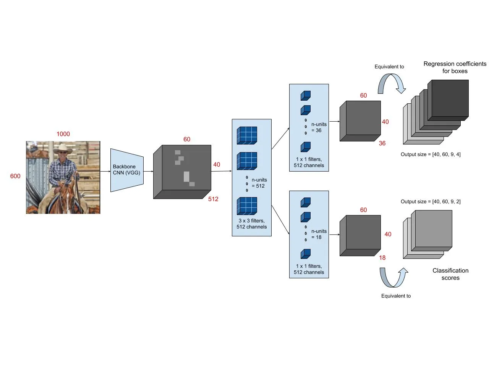</p>  
  
<h4 align="center" style="color: blue;">Faster RCNN</h4>
<p align="center">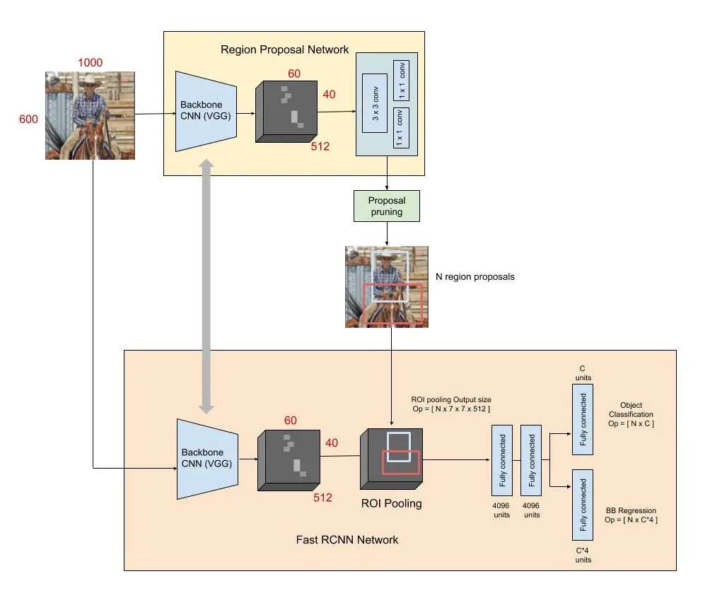</p>  

---

<h2 align="center" style="color: orange;">Object Detection Basics</h2>  

- **Ground Truth** = denotes the actual image bounding box which is annoted by the user.
- When we are detecting we have to check 2 things :
    1. Class of the object in the bounding box.
    2. Location of the bounding box.
- **Intersection Over Union** [IOU] = tells how much 2 boxes are related.
$$\text{IOU} = \frac{\text{Intersection area}}{\text{Union area}}$$
- **Precision** = 
$Precision = \frac{\text{True Positive}}{\text{True Positive + False Positive}}$
$$Precision = \frac{\text{True Positive}}{\text{All Detection}}$$
- **Recall** =
$Recall = \frac{\text{True Positive}}{\text{True Positive + False Negative}}$
$$Recall = \frac{\text{True Positive}}{\text{Total Ground Truth}}$$
- **True Positive.** = If the IOU between predicted box and ground truth is greater than threshold then it is True Positive.
- **Mean Average Precision** = 
$$MAP = \sum_{i = 1}^{k}\frac{\text{Average Precision}_{i}}{\text{k}}$$
- Where, k = Total Number of output class
- **Non-Max Supression** = Used for the clean up process to clean all the multiple region proposals of same objects except best one.  
    - Steps:
        1. Remove all prediction boxes with class probability < 0.7
        2. Choose a class in output classes.
        3. Find the predicition box which has the highest confidence called as Max Box.
        4. Remove all box of class which have IOU > 0.5 with the Max Box.
        5. Repeat Step 3 and Step 4 for all the instance of the class.
        6. Repeat Step 2, Step 3, Step 4 and Step 5 for all the class of the output classes.

---

<h2 align="center" style="color: orange;">Concept of Yolo</h2>

- YOLO = You Only Look Once
- Idea was to combine the region proposal network and bounding box regression(prediction).
- Here, There is **no concept of Region Proposal**.
- For an image we apply the Convolution Network and generate a feature map and **detect the object using anchor boxes**.
- Convolution Network extract the information from the region and align that information along the depth of the feature map.
    - If we have an image of (200 x 200) and a convolution neural network and generate a feaure map of (4 x 4). Then there will be a 16 crops or grid of (50 x 50) on the images. So, information present in each crop of the image will be captured in one pixel of feature map. This capturing information of original image on a small region of feature map is called Sub Sampling. 
    - Size of a crop on image will be based on dimensions of the feature map.
    - Smaller the grid size i.e larger shape of feature map the finner the objects detected .
- In each pixels of feature map we can detect only certian number of objects.
    - How many objects will be detect is discussed in the yolo versions.
    - example : Suppose each region can detect only 2 types of anchor box and 3 classes in the output then we will have a feature map depth of 16 (8 x 2).
    - **Depth 8 for each anchor map** in our example represent the following.
        1. Whether any object is present in the crop or not.
        2. Relative height of bounding box to the ground truth.
        3. Relative width of bounding box to the ground truth.
        4. X Coordinate of the bounding box.
        5. Y Coordinate of the bounding box.
        6. whether object present belong to class 1.
        7. whether object present belong to class 2.
        8. whether object present belong to class 3.
- There will be **supervision assoiated** with each pixel of the feature map.
- Then We calculate the dimensions of each possible anchor box.
- Then We calculate the loss and propogate back and update the weights and bais. 
- Within **1 Anchor box we can have only 1 object**.
- Size and Shape of the anchor box is decided using K Means Clustering.

---

<h2 align="center" style="color: orange;">Yolo V1</h2>

- Yolo v1 model is created on **pascal voc datasets** which contains 20 classes in output.
- Yolo v1 model can detect maximum of only **2 objects** in the crop.
- here objects were detected based on arbitary position there was **no concept of anchor box**.
- When image is passed through layers of convolutions and max pooling we will get the a feature map of **(7 x 7 x 30)**.
    - In depth of the feature map as we have 2 bounding box and each of the bounding box have 5 dimensions(Confidence score, height, width, coordinates of the center(x and y)) and we have 20 classes in output. Therefore, (2 x 5 + 20) = 30 depth in feature map.
- **Problems** in V1:
    1. Unable to detect **overlapping** object within the same crop.
    2. It was difficult to detect if **same class object has different size** in the image. 

---

<h2 align="center" style="color: orange;">Yolo V2</h2>

- Model Contains 19 Convolution layers and 5 Max pooling layers are present.
- Model contains batch normalization.
- Takes High resolution images as input 
    - Yolo V1 = (224 x 224) 
    - Yolo V2 = (448 x 448)
- Yolo V2 model there are only 2 types of Anchor boxes are added to detect 2 objects in a single grid.
    - Anchor boxes aspect ratio are detected using k means clustering. 
- Feature map size is increased to (13 x 13) to detect the smaller objects also. 

---

<h2 align="center" style="color: orange;">Yolo V3</h2>

- Yolo V3 model bought aspect ratio and size of the anchor box concept.
    - This model have 3 aspect ratio and in each aspect ratio we have 3 different size.
    - This model have 9 anchor box (3 x 3).
- So, yolo v3 model we can detect **9 object within a single crop at 3 scale independently**.
- Here, we detect the object then assign it to the closest anchor box then we detect the dimension of the object w.r.t anchor box.
- Steps: 
    1. We pass a image into convolution layers and skip layers and we get a feature map of **(13 x 13 x 225)**.
        - In Yolo V3 the **backbone architecture** is called as **darknet-53**.
        - **Depth = 3 anchor box x (5 dimensions + 80 classes) = 225**.
            - This model was trained on a dataset which has 80 classes.
            - Depth is 225 because in this feature map we are detecting only 3 aspect ratio types of anchor box means can detect only 3 object in grid or crop i.e large size types of anchor box. 
            - Each anchor box contains 5 dimensions of ground truth w.r.t anchor box(Confidence score, height, width, coordinates of the center(x and y)) and number of classes.
        - In this feature map model will detect **larger sized objects at scale 1** of 3 different aspect ratio(may be horizontal, vertical and square).
    2. Then we **Upsample** by passing into another set of convolutions and skip layers and we get a feature map of **(26 x 26 x 225)**.
        - In this feature map our v3 model we detect finner objects.
        - In this feature map model will detect **medium sized objects at scale 2** of 3 different aspect ratio.
    3. Again we **Upsample** by passing into convolutions and skip layers and we get a feaure map of **(52 x 52 x 255)**.
        - In this feature map our v3 model we detect more finner objects.
        - In this feature map model will detect **smaller sized objects at scale 3** of 3 different aspect ratio.
    - But, We know that our yolo v3 model can detect 9 objects in a single grid. So, yolo will detect a **larger, medium and smaller objects in 3 scales**. 
- In yolo v3 we detect larger object first then it do upsampling and then detect smaller objects because intially to detect smaller object we need more abstraction means deeper network is needed. So, v3 model first detect larger object from our image.
- **Upsampling** = Increasing the dimensions of the feature map.
    - There are 3 technique to do upsampling.
        1. **Nearest Neighbor** :
            - Here, we take a pixel of feature map then put in multiple place in the new feature map. 
        2. **Unpooling** :
            - When we do Max pooling we not only store the max values present in particular kernal size but also we store their index.
            - So in new feature map we store pixel values of current feature map in their index place of new feature map and remaining pixels of new feature map contains 0.
        3. **Transpose Convolution** :
            - Here, we will have a feature map and a kernel.
            - We take each pixel of a feature map and multiply with all the cells of the kernel and store in corresponding place of the new feature map.

<h4 align="center" style="color: blue;">Yolo V3</h4>
<p align="center">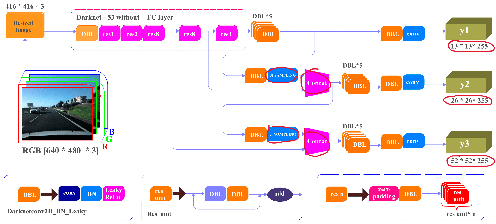</p>  

---

<h2 align="center" style="color: orange;">Yolo V4</h2>

- yolo v4 is a complex model which can detect **all the 9 anchor box**(9 images) present in a single crop at **1 scale** only not in 3 scale as of yolo v3.
- **Basic components** of an object detection
    1. Input image.
    2. Backbone architecture - a feature extractor.
    3. Neck - a feature aggregator.
    4. Head - prediction.
- In yolo v4 we will discuss mainly about backbone architecture(CSP Darknet-53) and Neck(Path Aggregation Network).
- But to understand CSP Darknet-53 backbone architecture used in yolo v4 we have to understand Densnet and CSPnet.
- Similarly to understand Path Aggregation Network(PAN) a feature aggregator used in yolo v4 we have to understand Feature Pyramid Network(FPN) and Spatial Pyramid Pooling(SPP).

1. **Backbone Achitecture** - feature extractor.
    1. **Dense Net :** 
            <h4 align="center" style="color: blue;">Dense Net</h4>
            <p align="center">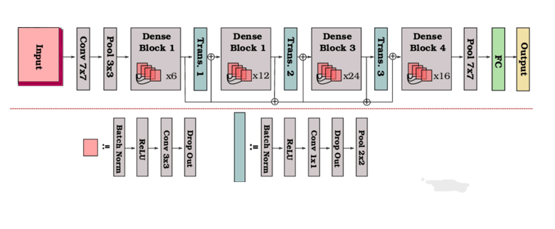</p>  
        - **Dense block** is a collection of n set of layers.
            - Each set of layers contains 4 layers - **Batch normalization -> Relu activation -> Convolution -> Dropout**.
            - But in Dense block the flow through n layers is not uniform. For each layers it will get input from the all previous feature map showed in the below diagram.
            - *Example* : the input for $i^th$ dense block will be $FeaureMap_{i - 1} + FeaureMap_{i - 2} + ..... + FeaureMap_{1} + input image$ . 
            <h4 align="center" style="color: blue;">Dense Block 5 set of layers</h4>
            <p align="center">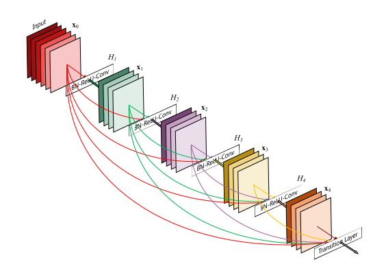</p>  
        - **Transition Layer** is used to do **downsampling** because dense block acts as feature extractor so to shrink feature map we have to downsample.
    2. **Cross Stage Partial(CSP) Net :**
            <h4 align="center" style="color: blue;">CSP</h4>
            <p align="center">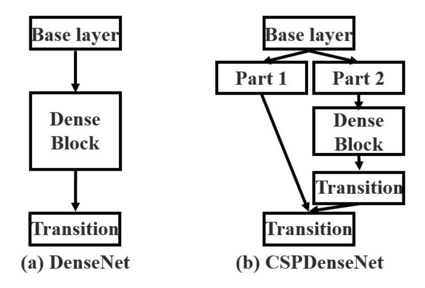</p>  
        - We used divide the image or feature map into 2 parts depth wise then apply dense net for 1st part and other part we will just concatinate with 1st part.
        - We divide into 2 parts and concatinate them after apply dense net to one part of it because we retain features of previous feature map and also create new feature map. 
    3. **CSP Darknet-53 :**
        - Used in yolo v4.
            <h4 align="center" style="color: blue;">CSP Darknet-53</h4>
            <p align="center">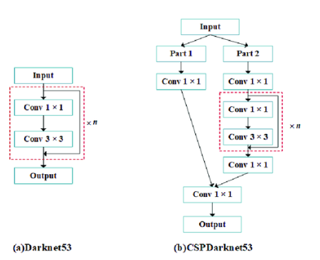</p> 
        - This backbone is a combination of dense net and also csp net.

2. **Neck** - feature aggregator.
    - Neck part is bascially a architectural change that we implement to **aggregate features of previous feature map with the current feature map**.
    - We aggregate features because to predict output in a **single scale**.
    - We bring feature from previous feature map because as we go **deeper** into the network we will **loss spatial information** and get **more sematic information** so to get the spactial information of that object we bring features from previous feature map.
    1. **Feature Pyramid Network (FPN) :**
        - Used in yolo v3 where prediction is done at 3 scales for detecting 9 types of anchor boxes.
            <h4 align="center" style="color: blue;">Feature Pyramid Network</h4>
            <p align="center">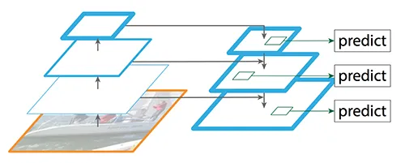</p> 
        - As we go on applying convolutions on the image we will get a **shallow layer** where we **can detect the larger objects** as there will be **more spatial information** but we **cannot detect small objects** as we will have **less sematic information** as we will have less feature map dimension and **less grid cells in image**. 
        - Then as we **do Upsampling** we will **go on losing spatial information** and we get **more sematic information** therfore we **can detect smaller objects** but to **locate** that smaller object we have lost spactial information in present feature map so we will use a **skip connection to bring spatial information from the previous feature map**.
        - We will **detect anchor box at each 3 scales** each scale contain 3 different aspect ratio anchor box and along the scale for same aspect ratio anchor boxes size will increase.
            > Anchor boxes have 2 things one is aspect ratio of anchor box and other is size of anchor box. we have 3 aspect ratio anchor boxes and each boxes have 3 different sizes totally we have 9 anchor boxes.
    2. **Path Aggregation Network (PAN) :**
        - Used in yolo v4 where prediction is done in only 1 scale for detecting all 9 types of anchor boxes.
            <h4 align="center" style="color: blue;">Path Aggregation Network</h4>
            <p align="center">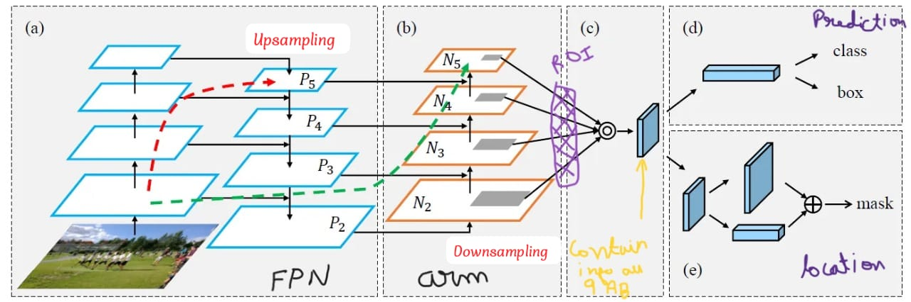</p> 
        - Here, we will modify the FPN by adding an **extra arm** to it where we generate feature map by **downsampling** and also **give skip connections** to it.
        - We add skip connections to give option for model to choose shorter path.
        - Here, **prediction is done at one scale** we aggregate all the feature map generated while downsampling and a single head will do prediction. 
        - To aggregate we will **Flatten the feature map** and then do **addition by elementwise** but we need same number of neuron after flattening for addition but we have different size feature map to make all the feature map uniform size. So, we apply **ROI pooling to make all the feature map uniform size**.

- We will have Dense for prediction of type of anchor box and sparse for prediction of location of anchor box.
<h3 align="center" style="color: blue;">Complete Yolo V4</h3>
<p align="center">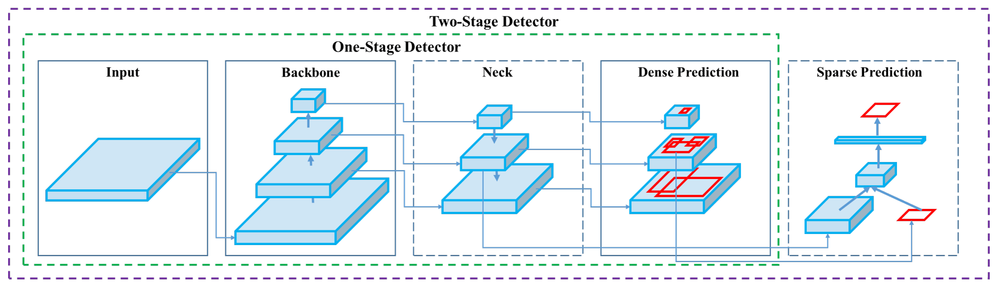</p>

- Mesh Activation Function = In CSP function to bring non linearity to data mesh activation is used.
<h4 align="center" style="color: blue;">Mesh Activation Function</h4>
<p align="center">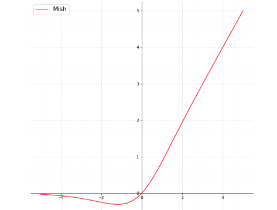</p> 

---

<h2 align="center" style="color: orange;">Yolo V5</h2>

- 

---

<h2 align="center" style="color: orange;">Yolo V6</h2>

- 

---

<h2 align="center" style="color: orange;">Yolo V7</h2>

- 

<h4 align="center" style="color: blue;">Yolo V7</h4>
<p align="center">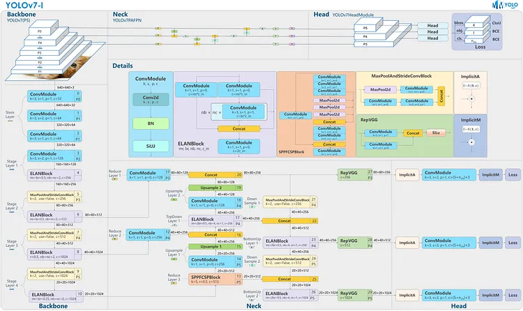</p> 

---

<h2 align="center" style="color: orange;">Yolo V5 Custom model training</h2>

1. Bring yolo v5 model.
    - ```!git clone https://github.com/ultralytics/yolov5.git``` or 
1. Instead of downloading as a zip we can also take as a code and paste it in our environment.
2. Install requirements.
    - ```%cd yolov5``` = opening the yolov5 folder which is cloned.
    - ```!pip install -qr requirements.txt```
3. Unzip the dataset.
    - ```%cd /content```
    - ```!curl -L "https://app.roboflow.com/ds/87xlDYwZRa?key=9AGS5pPZrx" > SKU.zip; unzip SKU.zip; rm SKU.zip```
    - unzip using your custom code after uploading zip file to google drive.
        - ```import zipfile```
        - ```with zipfile.ZipFile('file name', 'r') as zr:```
        - ```zr.extractall('destination folder name')```  
    - ```%cat data.yaml``` = to read and see the annoted file.
3. Extracting Number of classes from data.yml
    ```python
    import yaml
    with open("data.yaml", 'r') as stream:
        num_classes = str(yaml.safe_load(stream)['nc'])
    ```
4. Reading the yolo v5 small model.
    - ```%cat /content/yolov5/models/yolov5s.yaml```
    - contains 80 classes in output but our model may not have same so we have to change it.
5. Updating the number of classes in yaml file.
    ```python
    from IPython.core.magic import register_line_cell_magic

    @register_line_cell_magic
    def writetemplate(line, cell):
        with open(line, 'w') as f:
            f.write(cell.format(**globals()))
    ```
    - ```%%writetemplate /content/yolov5/models/custom_yolov5s.yaml``` = creating file
    - copy yaml which was read previous change the number of classes.
    - ```%cat /content/yolov5/models/custom_yolov5s.yaml``` = reading created custom yolo v5 model. 
6. Train the model on the custom data.
    - ```%%time```
    - ```%cd /content/yolov5/```
    - ```!python train.py --img 640 --batch 5 --epochs 20 --data '../data.yaml' --cfg ./models/custom_yolov5s.yaml --weights 'yolov5s.pt' --name yolov5s_results  --cache```
7. Visulaizing
    ```python
    from utils.plots import plot_results  # plot results.txt as results.png
    Image(filename='/content/yolov5/runs/train/yolov5s_results/results.png', width=1000)  # view results.png
    ```
    - Ground Truth Training data 
    ```python 
    print("GROUND TRUTH TRAINING DATA:")
    Image(filename='/content/yolov5/runs/train/yolov5s_results/val_batch0_labels.jpg', width=900)
    ```
    - Ground Truth Augmented Training Data
    ```python
    print("GROUND TRUTH AUGMENTED TRAINING DATA:")
    Image(filename='/content/yolov5/runs/train/yolov5s_results/train_batch0.jpg', width=900)
    ```
8. Trained Weights are by default saved in the weights folder. 
    - ```%ls runs/train/yolov5s_results/weights```
    - Detecting on training data
    ```
    %cd /content/yolov5/
    !python detect.py --weights runs/train/yolov5s_results/weights/best.pt --img 640 --conf 0.0005 --source ../test/images
    ```
9. Displying inference of all the test images
    ```python
    import glob
    from IPython.display import Image, display

    for imageName in glob.glob('/content/yolov5/runs/detect/exp/*.jpg'): #assuming JPG
        display(Image(filename=imageName))
        print("\n")
    ```
10. Exporting weights for future inference
    ```python
    from google.colab import drive
    drive.mount('/content/gdrive')
    ```

---
